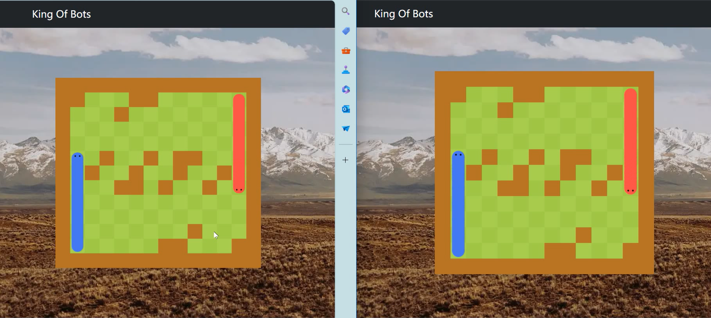
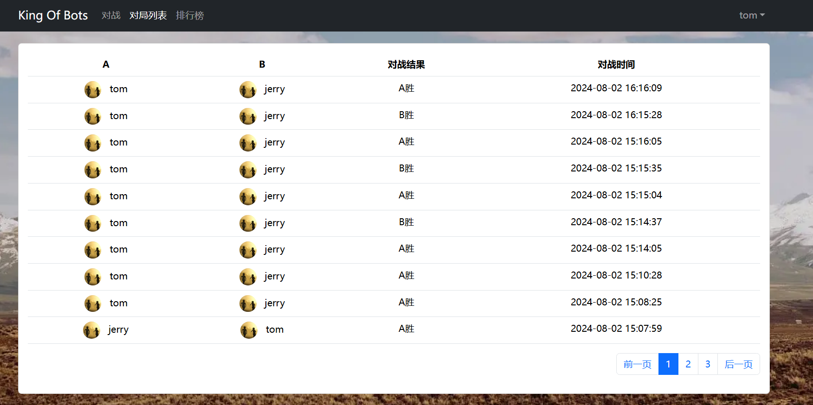
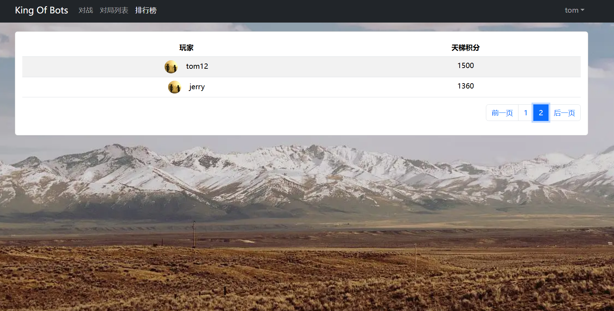
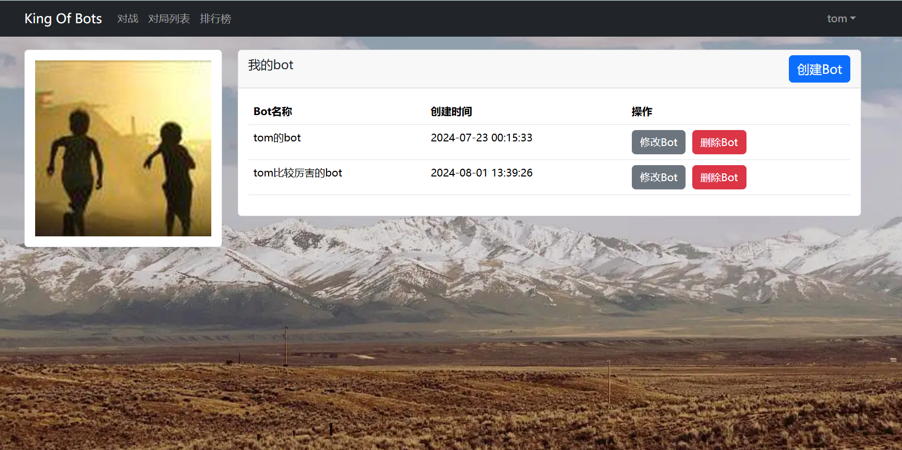
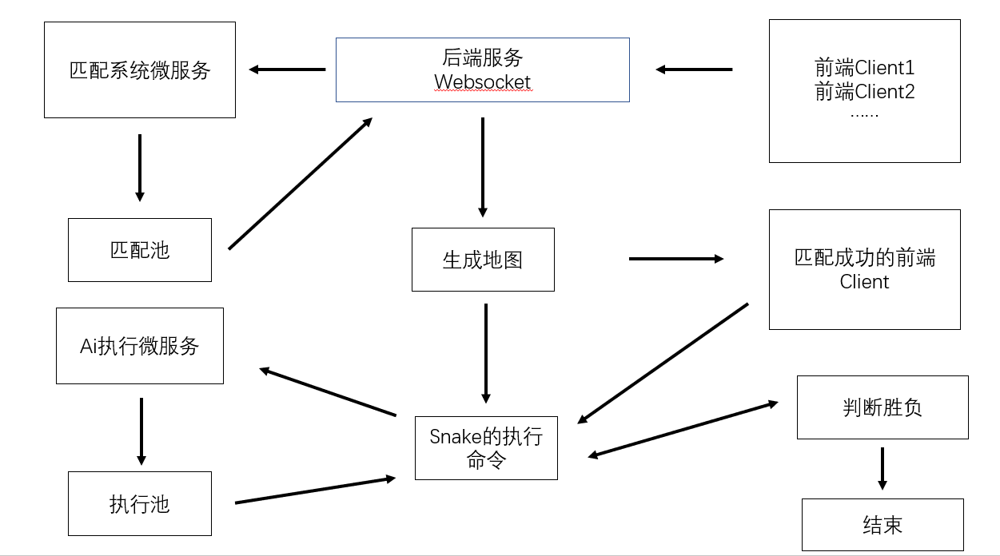

## 贪吃蛇ai对战平台

###　项目演示

1. 战斗页面



2. 匹配页面

   

3. 对局列表

   

4. 排行榜

   

5. 我的bot页面

   

### 游戏规则

确切地说，这并不是贪吃蛇。 与传统单人贪吃蛇不同的是，本贪吃蛇为双人对战，每回合玩家同时做出决策控制自己的蛇。
玩家在 13×14 的网格中操纵一条蛇(蛇是一系列坐标构成的有限不重复有顺序的序列，序列中相邻坐标均相邻，即两坐标的 x 轴坐标或 y 轴坐标相同， 坐标从0开始，x 轴代表行，y 轴代表列，序列中最后一个坐标代表蛇头)，玩家只能控制蛇头的朝向(上、下、左、右)来控制蛇。蛇以恒定的速度 前进(前进即为序列末尾插入蛇头指向方向下一格坐标，并删除序列头坐标)。蛇的初始位置在网格中的左下角(地图位置[11, 1])与右上角(地图 位置[1, 12])，初始长度为 1 格。与传统贪吃蛇不同，本游戏在网格中并没有豆子，但蛇会自动长大(长大即为不删除序列头坐标的前进)，前10回 合每回合长度增加 1，从第 11 回合开始，每 3 回合长度增加 1。

地图为13×14的网格，由1×1的草地与障碍物构成。

蛇头在网格外、障碍物、自己蛇的身体(即序列重复)、对方蛇的身体(即与对方序列有相同坐标)，或非法操作均判定为死亡。任何一条蛇死亡时， 游戏结束。若蛇同时死亡，判定为平局，否则先死的一方输，另一方赢。

### 交互方式

若玩家选择亲自出马，玩家可直接通过'w'、'a'、's'、'd'方向键控制己方蛇的运动方向。

若玩家选择派出 Bot 出战，则 Bot 代码每回合需从标准输入读入一个字符串，并在标准输出中输出一个数字代表己方蛇运动方向。

**输出格式:** 一个整数，代表运动方向。0 代表向上，1 代表向右，2 代表向下，3 代表向左。

**ai操作的实例代码**

```java
package com.kob.botRunningSystem.utils;

import java.util.ArrayList;
import java.util.List;

public class Bot implements com.kob.botRunningSystem.utils.BotInterface{
    static class Cell {
        public int x,y;
        public Cell(int x,int y){
            this.x = x;
            this.y = y;
        }
    }
    private boolean check_tail_increasing(int step){
        if(step<=10) return true;
        return step%3==1;
    }

    public List<Cell> getCells(int sx,int sy, String steps){
        List<Cell> res = new ArrayList<>();
        int dx[] = {-1,0,1,0},dy[]={0,1,0,-1};
        steps = steps.substring(1,steps.length()-1);

        int x=sx,y=sy;
        int step = 0;
        res.add(new Cell(x,y));

        for(int i=0;i<steps.length();i++){

            int d = steps.charAt(i)-'0';
            x+=dx[d];
            y+=dy[d];
            //加上蛇头
            res.add(new Cell(x,y));
            if(!check_tail_increasing(++step)){
                res.remove(0); //去掉蛇尾
            }
        }
        return res;
    }

    @Override
    public Integer nextMove(String input) {
        String strs[] = input.split("#");
        int g[][] = new int[13][14];
        //画地图，知道哪里有墙
        for(int i=0,k=0;i<13;i++){
            for(int j=0;j<14;j++,k++){
                if(strs[0].charAt(k)=='1'){
                    g[i][j] = 1;
                }
            }
        }

        int aSx = Integer.parseInt(strs[1]),aSy = Integer.parseInt(strs[2]);
        int bSx = Integer.parseInt(strs[4]),bSy = Integer.parseInt(strs[5]);

        List<Cell> aCells = getCells(aSx,aSy,strs[3]);
        List<Cell> bCells = getCells(bSx,bSy,strs[6]);

        for(Cell c:aCells) g[c.x][c.y] = 1;
        for(Cell c:bCells) g[c.x][c.y] = 1;

        int dx[] = {-1,0,1,0},dy[]={0,1,0,-1};
        for(int i=0;i<4;i++){
            int x = aCells.get(aCells.size()-1).x+dx[i];
            int y = aCells.get(aCells.size()-1).y+dy[i];
            //判断是否越界
            if(x>=0&&x<13&&y>=0&&y<14&&g[x][y]!=1){
                return i;
            }
        }
        //如果越界，则返回0，也就是向上走，即蛇死亡
        return 0;

    }
}
```

### 游戏架构

